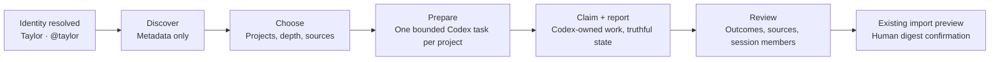

# Project Archaeology onboarding continuation

Project Archaeology is an optional continuation after the accepted Codex identity
resolve. It does not delay authentication and never starts work without a human
choice.

## Frame 1 — Bring your work into Commons

- Same white, quiet, 14 px-radius modal used by Codex onboarding; wider only to
  support project rows.
- Identity line carries the completed profile forward: `Taylor · @taylor`.
- Primary copy: "Bring your work into Commons".
- Calm explanation: Commons first checks project names, source signals, and
  recent activity. It does not read file or conversation contents during
  discovery.
- Primary action: `Find projects`. Secondary action: `Skip for now`.
- No automatic discovery, spinner, fake percentage, or hidden task start.

## Frame 2 — Choose what to explore

- Candidate projects are simple selectable rows, not cards. Each row shows a
  safe path label, available source signals, last activity, and a truthful time
  range.
- `Select all` is paired with the selected count.
- Configuration follows the project list in three compact fieldsets:
  `Quick | Standard | Deep`, `Git | Documentation | Codex history`, and
  `1 | 2 at a time`.
- Cost and privacy copy updates with depth and sources. It never claims exact
  tokens, completion time, or file coverage.
- Primary action: `Start Codex tasks`. The action states the number of
  projects and is disabled until at least one project and one source are chosen.
- Commons does not claim that this launches a task. The prepared pack is a
  durable, bounded handoff that Codex can claim and report against.

## Frame 3 — Continue in Codex

- The prepared pack shows its durable handoff ID and one bounded task per
  selected project. It never renders a spinner, percentage, fake historian, or
  unsupported launch button.
- Exact task and thread IDs are secondary provenance. `Close` leaves durable tasks running
  ready to claim. Both are explicit about what Commons did and did not start.
- Once Codex claims the pack, the surface waits for a validated result report.
- Counts appear only when reported by Codex. Pause, resume, and cancel appear
  only when the backend capability explicitly supports those actions; the
  export/claim/report pilot does not simulate them.
- An unavailable handoff is a complete state with its server reason and a calm
  return path, not a disabled primary action.

## Frame 4 — Review what Commons found

- Proposed outcomes are review rows with title, concise summary, project,
  bounded source count, and an explicit provenance disclosure.
- Exact session IDs are labeled `Commons member` even when historical or
  offline. Membership is durable and is shown separately from reachability,
  execution state, and authority; absent facts read `Not observed`, never
  `offline` or `unauthorized`.
- Session evidence may show contributions, sources, collaborations,
  demonstrated strengths, and uncertainties. It does not assign a rigid persona.
- Primary action: `Review import preview`. This passes the validated historical
  import proposal to the existing canonical preview.
- The confirmation frame shows the exact source digest, current-wins collision
  policy, creates/skips/replays, and requires the human to enter the entire
  digest. Only the existing canonical apply endpoint can mutate project history.

## Responsive and accessibility contract

- At 760 px and below, columns become one reading order; at 420 px and below,
  modal padding is 16 px and footer actions stack full width.
- The experience reflows at 320 px, 390 px, desktop, and 200% zoom without
  horizontal scrolling.
- Every group has a `legend`; selection uses native checkboxes or
  `aria-pressed`; live state uses a single polite status region.
- Escape, Close, and Skip are equivalent and non-destructive before a run.
  During a run, closing hides the surface but does not imply cancellation.
- Focus returns to the invoking control. No color-only state communication.
