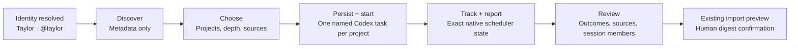

# Project Archaeology onboarding continuation

Project Archaeology is an optional continuation after the accepted Codex identity
resolve. It does not delay authentication and never starts work without a human
choice.

## Frame 1 — Bring your work into Commons

- Same white, quiet, 14 px-radius modal used by Codex onboarding; wider only to
  support project rows.
- Identity line carries the completed profile forward: `Taylor · @taylor`.
- Primary copy: "Bring your work into Commons".
- Calm explanation: Commons first checks project names, source signals, and
  recent activity. Codex 0.147 may send preview bytes on the inventory wire;
  Commons immediately discards them and retains only sanitized workspace
  metadata.
- Primary action: `Find projects`. Secondary action: `Skip for now`.
- No automatic discovery, spinner, fake percentage, or hidden task start.

## Frame 2 — Choose what to explore

- Candidate projects are simple selectable rows, not cards. Each row shows a
  safe path label, available source signals, last activity, and a truthful time
  range.
- `Select all` is paired with the selected count.
- Configuration follows the project list in three compact fieldsets:
  `Quick | Standard | Deep`, `Git | Documentation | Codex history`, and
  `1 | 2 at a time`.
- Cost and privacy copy updates with depth and sources. It never claims exact
  tokens, completion time, or file coverage.
- Primary action names both durable effects: Commons persists the selected
  projects, then starts one ordinary named Codex task per project.
- A malformed or transient start response is reconciled with one canonical
  read. A validated native batch is restored without a duplicate start; an
  unverifiable response stays in configuration with no lifecycle claim.

## Frame 3 — Follow the native run

- The native ledger shows its batch ID and one bounded task per selected
  project. It never renders a percentage, fake historian, retry, or unsupported
  lifecycle control.
- Exact task and thread IDs are secondary provenance. `Close` only hides the
  surface: accepted tasks continue and queued tasks remain queued.
- The surface waits for bounded progress and a validated report from each exact
  bound native task.
- Counts appear only when reported by Codex. Cancel appears only when the
  backend authorizes it; pause, resume, retry, task packs, and external claiming
  are not native controls.
- An unavailable handoff is a complete state with its server reason and a calm
  return path, not a disabled primary action.

## Native scheduler lifecycle

- Starting a run adds only missing empty Commons project/topic shells and queues
  named tasks (`Project history · <project>`). It imports zero Tasks or history.
- Native rows use separate candidate, canonical project, job, batch, thread, and
  turn identities. Task names lead; identifiers stay secondary and copyable.
- Exact native states are rendered literally. Commons submits every manually
  confirmed job; Codex governs execution capacity. Queued/active/report/attention
  counts come from the bounded backend progress.
- Cancel appears only for a server-authorized native queued/running batch. It
  stops queued work, requests interruption for active work, preserves audit
  history, and never implies pause, retry, or automatic restart.
- `claimed` rows from the earlier launch path render only as `Legacy historian ·
  status not reconciled`; they expose no lifecycle controls.
- Hidden tabs stop and abort polling. The ledger retains known rows and reports
  `Updates paused while this tab was hidden`, `Updates restored`, and last check.
- Completed/canceled native batches retain their ledger and review outcomes and
  may expose `Choose more projects` only when the server returns `can_start`.

## Frame 4 — Review what Commons found

- Proposed outcomes are review rows with title, concise summary, project,
  bounded source count, and an explicit provenance disclosure.
- Exact session IDs are labeled `Commons member` even when historical or
  offline. Membership is durable and is shown separately from reachability,
  execution state, and authority; absent facts read `Not observed`, never
  `offline` or `unauthorized`.
- Session evidence may show contributions, sources, collaborations,
  demonstrated strengths, and uncertainties. It does not assign a rigid persona.
- Native report details remain view-only (`can_apply=false`) and use `Back to
  run` when opened from the retained ledger.
- `Review exact proposal` appears only when both the report and capability
  authorize it. The production-valid bridge contains every bounded task and
  evidence row.
- The confirmation frame shows both the server-derived manifest digest and the
  source digest, current-wins collision policy, and creates/skips/replays. The
  human enters the complete manifest digest; the apply request confirms both
  digests. Only the canonical apply endpoint can mutate project history.

## Responsive and accessibility contract

- At 760 px and below, columns become one reading order; at 420 px and below,
  modal padding is 16 px and footer actions stack full width.
- The experience reflows at 320 px, 390 px, desktop, and 200% zoom without
  horizontal scrolling.
- Every group has a `legend`; selection uses native checkboxes or
  `aria-pressed`; live state uses a single polite status region.
- Escape, Close, and Skip are equivalent and non-destructive before a run.
  During a run, closing hides the surface but does not imply cancellation.
- Focus returns to the invoking control. No color-only state communication.
